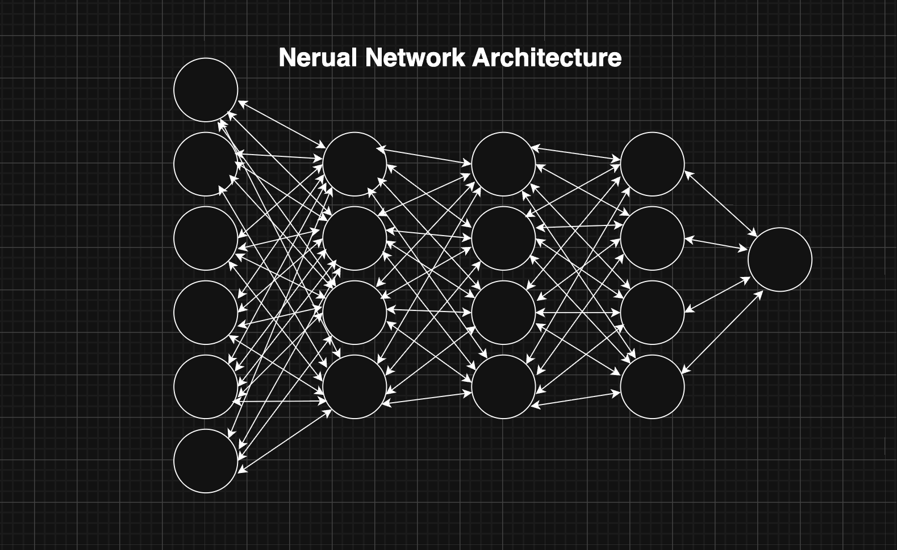

# Social Media & Productivity Score Predictor

A machine learning application that predicts a user's productivity score based on their daily habits and social media usage. Features a dual-model comparison between a Gradient Boosting Regressor and a PyTorch Neural Network, with a full-stack web application available on a separate branch.

---

## Branches

| Branch | Description |
|---|---|
| `main` | ML analysis, model training, and EDA — run via `console.py` |
| `web_app` | Full-stack web application with Flask REST API, MySQL logging, and HTML/CSS/JS frontend |

---

## Features
- **Dual ML Models:** Gradient Boosting Regressor (scikit-learn) and a Fully Connected Neural Network (PyTorch)
- **Model Comparison:** Side-by-side evaluation using R² Score and Mean Absolute Error (MAE)
- **Hyperparameter Tuning:** GridSearchCV used to identify optimal parameters for Gradient Boosting
- **Exploratory Data Analysis:** Scatter plots, histograms, and subplots visualizing key feature relationships

---

## Project Structure

```
├── model/
│   ├── model.py              # Gradient Boosting model + predict function
│   ├── neuralNetwork.py      # PyTorch Neural Network training, evaluation, and predict function
│   ├── analysis.py           # EDA visualizations and model comparison charts
│   ├── histogram.py          # Age distribution histogram
│   └── console.py            # Entry point — runs all analysis and visualizations
├── data/
│   └── social.csv            # Kaggle dataset: Social Media & Productivity
├── images_analysis/
│   ├── nn_image.png          # Neural Network architecture diagram
│   └── Data_Used_for_paper_visual.png  # EDA subplot visualization
└── requirements.txt          # Required libraries
```

---

## Machine Learning Components

### Models Evaluated
- **GradientBoostingRegressor** — Sequential ensemble method; each tree learns from and corrects its predecessor
- **Neural Network (PyTorch)** — Fully connected feed-forward network with ReLU activations

### Gradient Boosting — Hyperparameter Tuning
Tuned via `GridSearchCV`:
- `n_estimators`: 150
- `learning_rate`: 0.1

### Neural Network Architecture
```
Input Layer:    6 nodes  (one per feature)
Hidden Layer 1: 4 nodes + ReLU
Hidden Layer 2: 4 nodes + ReLU
Hidden Layer 3: 4 nodes + ReLU
Output Layer:   1 node   (productivity score)

Optimizer:  SGD (lr=0.001)
Loss:       MSELoss
Epochs:     100
Batch Size: 32
```

### Model Evaluation

| Model | R² Score | MAE |
|---|---|---|
| Neural Network | ~88.4% | ~7.2 |
| Gradient Boosting | ~88.2% | ~8.0 |

---

## Data & Preprocessing

**Dataset:** [Social Media & Productivity — Kaggle](https://www.kaggle.com)

**Features used (X):**
- `age`
- `daily_screen_time`
- `social_media_hours`
- `study_hours`
- `sleep_hours`
- `notifications_per_day`

**Target (Y):** `productivity_score`

**Preprocessing steps:**
- Dropped null rows with `dropna()`
- Removed extraneous columns: `addiction_level`, `focus_score`
- Cast `age` and `notifications_per_day` to integer with `pd.to_numeric`
- Applied `StandardScaler` for Neural Network input
- Data placed into `TensorDataset` → `DataLoader` (batch_size=32) for PyTorch training
- 70/30 train-test split (`random_state=42`)

---

## Installation & Setup

**Prerequisites:**
- Python 3.11+
- pip

**Install dependencies:**
```bash
pip install pandas numpy scikit-learn matplotlib torch torchmetrics
```

**How to Run:**
```bash
python console.py (ENTER THE MODEL FOLDER/DIRECTORY and then run the file) 
```

---

## Visualizations

### Neural Network Architecture


### Exploratory Data Analysis


---

## Tech Stack

| Layer | Technology |
|---|---|
| ML (Classical) | scikit-learn (GradientBoostingRegressor, GridSearchCV) |
| ML (Deep Learning) | PyTorch, torchmetrics |
| Data | pandas, NumPy |
| Visualization | matplotlib |
